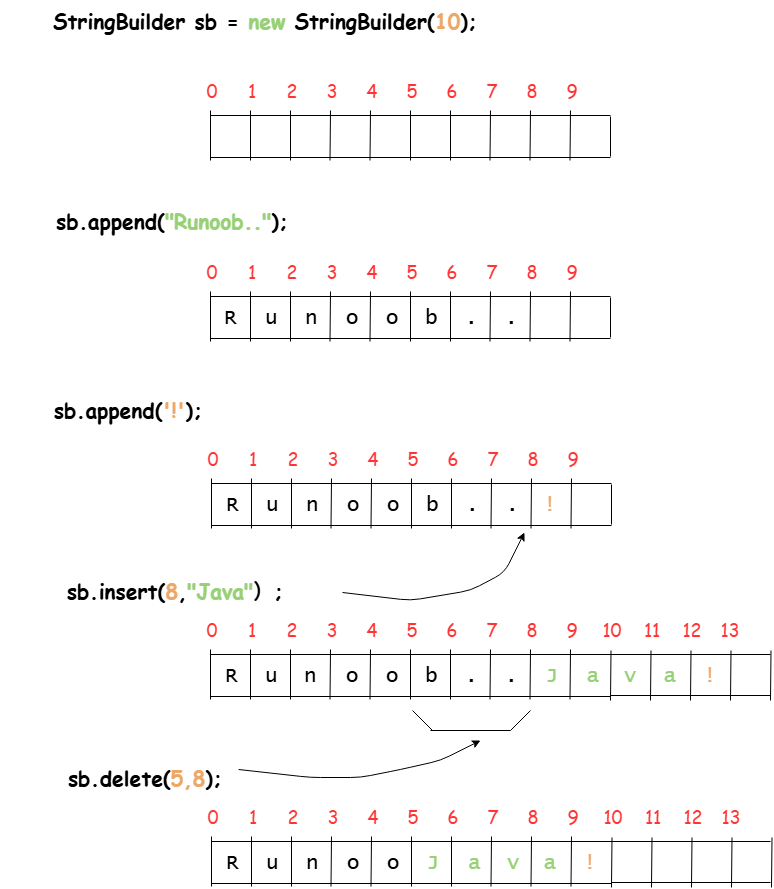
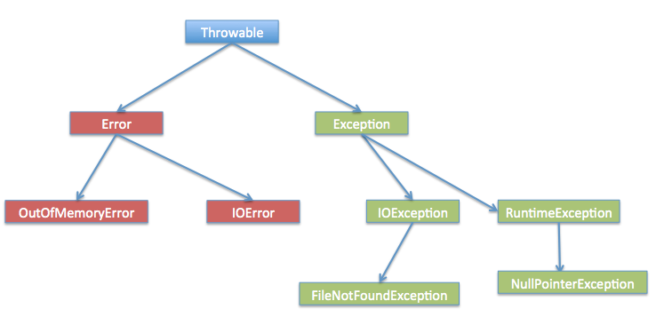
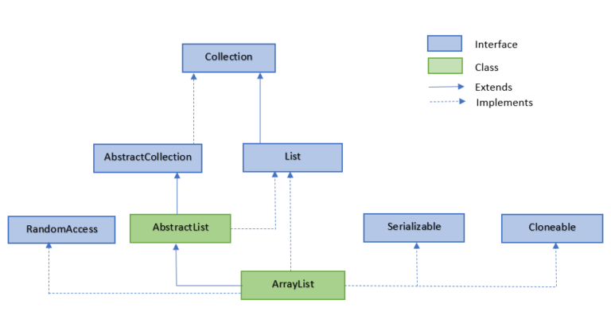
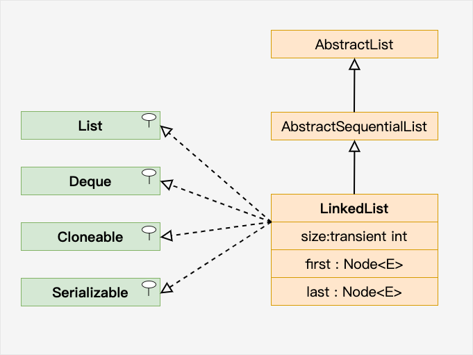
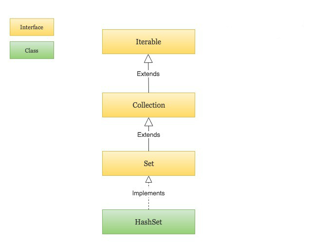
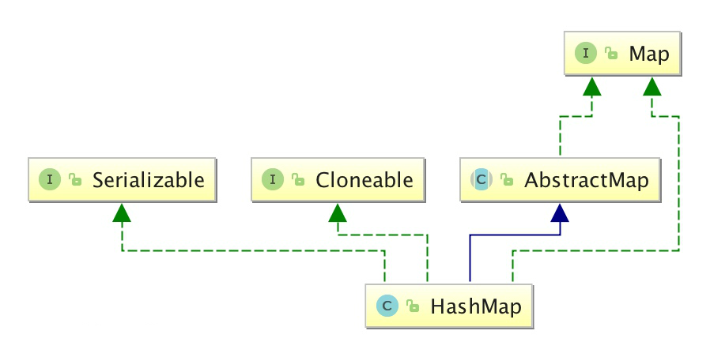

# Java

## Java 教程

### Java 基本数据类型

1. **内置类型**：Java 提供了八种基本数据类型，6 种数字类型，1 种字符类型，1 种布尔类型，分别是 `byte`、`short`、`int`、`long`、`float`、`double`、`char` 和 `boolean`。

- `byte`：表示 8 位有符号整数，范围从 -128(-2^7) 到 127(2^7-1)，默认值 0。
- `short`：表示 16 位有符号整数，范围从 -32,768(-2^15) 到 32,767(2^15-1)，默认值 0。
- `int`：表示 32 位有符号整数，范围从 -2^31 到 2^31-1，默认值 0。
- `long`：表示 64 位有符号整数，范围从 -2^63 到 2^63-1，默认值 0L。
- `float`：表示 32 位单精度浮点数，默认值 0.0f。
- `double`：表示 64 位双精度浮点数，默认值 0.0d。
- `char`：表示 16 位 Unicode 字符，范围从 \u0000 到 \uffff，默认值 '\u0000'。
- `boolean`：表示布尔值，只有两个取值：true 和 false，默认值 false。

| 数据类型 | 大小（字节） | 默认值   | 取值范围         |
| :------- | :----------- | :------- | :--------------- |
| byte     | 1            | 0        | -128~127         |
| short    | 2            | 0        | -32,768~32,767   |
| int      | 4            | 0        | -2^31~2^31-1     |
| long     | 8            | 0L       | -2^63~2^63-1     |
| float    | 4            | 0.0f     | 1.4E-45~3.4E38   |
| double   | 8            | 0.0d     | 4.9E-324~1.8E308 |
| char     | 2            | '\u0000' | 0~65535          |

```java
public class PrimitiveTypeTest {
    public static void main(String[] args) {
        // byte
        System.out.println("基本类型：byte 二进制位数：" + Byte.SIZE);
        System.out.println("包装类：java.lang.Byte");
        System.out.println("最小值：Byte.MIN_VALUE=" + Byte.MIN_VALUE);
        System.out.println("最大值：Byte.MAX_VALUE=" + Byte.MAX_VALUE);
        System.out.println();

        // short
        System.out.println("基本类型：short 二进制位数：" + Short.SIZE);
        System.out.println("包装类：java.lang.Short");
        System.out.println("最小值：Short.MIN_VALUE=" + Short.MIN_VALUE);
        System.out.println("最大值：Short.MAX_VALUE=" + Short.MAX_VALUE);
        System.out.println();

        // int
        System.out.println("基本类型：int 二进制位数：" + Integer.SIZE);
        System.out.println("包装类：java.lang.Integer");
        System.out.println("最小值：Integer.MIN_VALUE=" + Integer.MIN_VALUE);
        System.out.println("最大值：Integer.MAX_VALUE=" + Integer.MAX_VALUE);
        System.out.println();

        // long
        System.out.println("基本类型：long 二进制位数：" + Long.SIZE);
        System.out.println("包装类：java.lang.Long");
        System.out.println("最小值：Long.MIN_VALUE=" + Long.MIN_VALUE);
        System.out.println("最大值：Long.MAX_VALUE=" + Long.MAX_VALUE);
        System.out.println();

        // float
        System.out.println("基本类型：float 二进制位数：" + Float.SIZE);
        System.out.println("包装类：java.lang.Float");
        System.out.println("最小值：Float.MIN_VALUE=" + Float.MIN_VALUE);
        System.out.println("最大值：Float.MAX_VALUE=" + Float.MAX_VALUE);
        System.out.println();

        // double
        System.out.println("基本类型：double 二进制位数：" + Double.SIZE);
        System.out.println("包装类：java.lang.Double");
        System.out.println("最小值：Double.MIN_VALUE=" + Double.MIN_VALUE);
        System.out.println("最大值：Double.MAX_VALUE=" + Double.MAX_VALUE);
        System.out.println();

        // char
        System.out.println("基本类型：char 二进制位数：" + Character.SIZE);
        System.out.println("包装类：java.lang.Character");
        // 以数值形式而不是字符形式将Character.MIN_VALUE输出到控制台
        System.out.println("最小值：Character.MIN_VALUE="
                + (int) Character.MIN_VALUE);
        // 以数值形式而不是字符形式将Character.MAX_VALUE输出到控制台
        System.out.println("最大值：Character.MAX_VALUE="
                + (int) Character.MAX_VALUE);
    }
}
```

2. **引用类型**：除了基本数据类型，Java 还提供了引用类型，包括类、接口、数组等。

3. **自动类型转换**：必须满足转换前的数据类型的位数要低于转换后的数据类型，例如: short 数据类型的位数为 16 位，就可以自动转换位数为 32 的 int 类型，同样 float 数据类型的位数为 32，可以自动转换为 64 位的 double 类型

数据类型转化需要满足一下规则

- 不能对 boolean 类型进行类型转换
- 不能把对象类型转换成不相关类的对象
- 在把容量大的类型转换为容量小的类型时必须使用强制类型转换
- 转换过程中可能导致溢出或损失精度
- 浮点数到整数的转换是通过舍弃小数得到，而不是四舍五入

4. **强制类型转换**：条件是转换的数据类型必须是兼容的

### Java StringBuffer 和 StringBuilder

核心区别就在于**线程安全性**。

#### 核心总结

| 特性         | StringBuffer              | StringBuilder                |
| :----------- | :------------------------ | :--------------------------- |
| **线程安全** | **是** (同步的，线程安全) | **否** (不同步，线程不安全)  |
| **性能**     | **较低** (因为同步的开销) | **较高** (通常快 10%-15%)    |
| **版本**     | Java 1.0                  | Java 1.5                     |
| **使用场景** | 多线程环境，共享变量      | 单线程环境，或方法内局部变量 |

---

#### 详细解析

##### 1. 线程安全性 (Thread Safety)

这是两者最根本、最重要的区别。

- **StringBuffer**： 是**线程安全**的。它的所有公开方法（如 `append()`, `insert()`, `delete()`）都使用了 **`synchronized`** 关键字进行修饰。这意味着多个线程在同一时间无法同时调用一个 StringBuffer 实例的这些方法，从而保证了数据的一致性，避免了竞态条件。

  ```java
  // StringBuffer 源码片段 (简化)
  @Override
  public synchronized StringBuffer append(String str) {
      toStringCache = null;
      super.append(str);
      return this;
  }
  ```

- **StringBuilder**： 是**线程不安全**的。它的方法**没有**使用 `synchronized` 修饰。因此，在多线程环境下同时操作同一个 StringBuilder 实例会导致不可预知的结果。但它也因此避免了同步带来的性能开销。
  ```java
  // StringBuilder 源码片段 (简化)
  @Override
  public StringBuilder append(String str) {
      super.append(str);
      return this;
  }
  ```

##### 2. 性能 (Performance)

由于 `StringBuffer` 的方法需要进行同步检查，而 `StringBuilder` 不需要，所以在**单线程环境**下，`StringBuilder` 的性能**显著高于** `StringBuffer`。

在大多数操作中，`StringBuilder` 的性能提升大约在 **10% 到 15%** 之间。虽然这个数字看起来不大，但在执行大量字符串拼接操作（如循环体内）时，性能差距会变得非常明显。

##### 3. 版本和历史 (Version)

- **StringBuffer** 从 Java 1.0 开始就存在了。
- **StringBuilder** 是在 Java **1.5** 版本中才被引入的。Sun 公司发现大部分字符串操作都是在单线程环境下进行的（例如方法内的局部变量），为这些场景专门设计一个非线程安全的类可以大幅提升性能。

---

#### 如何选择？

遵循一个非常简单直接的原则：

1.  **如果你的操作是在单线程下进行的，或者该对象不会被多个线程共享（例如，作为方法内的局部变量），那么请毫不犹豫地使用 `StringBuilder`。** 这是目前**绝大多数**的情况，也是默认的最佳选择。

2.  **只有在你的对象会被多个线程同时访问和修改时，才使用 `StringBuffer`。** 但这种场景在现代 Java 开发中相对较少，因为开发者更倾向于使用其他更现代的同步机制来控制并发访问，而不是依赖一个重量级的同步类。

#### 代码示例

**单线程环境示例 (推荐使用 StringBuilder)：**

```java
public class SingleThreadExample {
    public static void main(String[] args) {
        // 方法内局部变量 - 单线程，绝对安全
        StringBuilder sb = new StringBuilder();

        for (int i = 0; i < 10000; i++) {
            sb.append("hello"); // 性能更高
        }
        System.out.println(sb.length());
    }
}
```

**多线程环境示例 (必须使用 StringBuffer 或其他同步手段)：**

```java
public class MultiThreadExample {
    // 共享变量
    private static StringBuffer sharedBuffer = new StringBuffer();

    public static void main(String[] args) throws InterruptedException {
        Thread t1 = new Thread(() -> {
            for (int i = 0; i < 1000; i++) {
                sharedBuffer.append("A");
            }
        });

        Thread t2 = new Thread(() -> {
            for (int i = 0; i < 1000; i++) {
                sharedBuffer.append("B");
            }
        });

        t1.start();
        t2.start();
        t1.join();
        t2.join();

        // 使用 StringBuffer 结果是稳定的 2000
        // 如果使用 StringBuilder，结果可能小于 2000，且每次运行可能不同
        System.out.println("Length: " + sharedBuffer.length());
    }
}
```

**注意**：即使在多线程环境下，如果每个线程都使用自己独立的 `StringBuilder` 实例（即不共享），那么使用 `StringBuilder` 也是完全安全且更高效的。

#### 共同点

- 都继承自 `AbstractStringBuilder` 类。
- 都是**可变的**（mutable）字符序列，这意味着它们可以在原地修改内容（追加、插入、删除等），而不会像 `String` 那样产生大量临时对象。
- 它们的 API 几乎完全一样，都提供了 `append()`, `insert()`, `delete()`, `reverse()` 等方法。这意味着它们在实际代码中可以很容易地互相替换（但要注意线程安全）。
  

#### 结论

**在现代 Java 开发中，`StringBuilder` 是默认的首选，除非你有明确的、必须要求线程安全的理由。** 编译器在处理字符串拼接操作 `+` 时，在底层默认使用的也是 `StringBuilder`（在循环体内尤其要注意，手动创建 `StringBuilder` 通常性能更好）。

### Java 异常处理

#### 异常发生的原因

1. **用户输入错误**：例如，用户输入了无效的日期格式。
2. **运行时错误**：例如，除以零。
3. **外部资源错误**：例如，网络连接失败或文件不存在。

#### 异常的分类

Java 异常分为两大类：**检查型异常（Checked Exceptions）** 和 **运行时异常（Runtime Exceptions）**。

1. **检查型异常（Checked Exceptions）**：这些异常在编译时被检查，必须被显式捕获或声明抛出。常见的检查型异常包括 `IOException`, `SQLException`, `ClassNotFoundException` 等。
2. **运行时异常（Runtime Exceptions）**：这些异常在运行时发生，不需要显式捕获或声明抛出。常见的运行时异常包括 `NullPointerException`, `ArrayIndexOutOfBoundsException`, `ArithmeticException` 等。

#### 异常处理的关键字

Java 提供以下关键字来处理异常：

1. **try**：用于包裹可能抛出异常的代码块。
2. **catch**：用于捕获并处理特定的异常类型。
3. **finally**：用于执行无论是否发生异常都要执行的代码块。
4. **throw**：用于手动抛出一个异常。
5. **throws**：用于声明一个方法可能抛出的异常。

#### Exception 类的层次



#### Java 内置的异常类

1. 非检查型异常（Runtime Exceptions）
   - `NullPointerException` **空指针异常**：当应用程序试图在需要对象的地方使用 null 时，抛出该异常
   - `ArrayIndexOutOfBoundsException` **数组越界异常**：当应用程序试图访问数组中不存在的索引时，抛出该异常
   - `ArithmeticException` **算术异常**：当应用程序执行除以零等非法运算时，抛出该异常
   - `ClassCastException` **类型转换异常**：当应用程序试图将对象转换为不兼容的类型时，抛出该异常
   - `IllegalArgumentException` **非法参数异常**：当应用程序使用非法或不适当的参数调用方法时，抛出该异常
   - `IllegalStateException` **非法状态异常**：当应用程序试图在对象处于非法或不适当的状态下调用方法时，抛出该异常
   - `NumberFormatException` **数字格式异常**：当应用程序试图将字符串转换为数字，但字符串的格式不正确时，抛出该异常
   - `IndexOutOfBoundsException` **索引越界异常**：当应用程序试图访问数组或集合中不存在的索引时，抛出该异常
   - `ConcurrentModificationException` **并发修改异常**：当应用程序试图在迭代过程中修改集合时，抛出该异常
   - `UnsupportedOperationException` **不支持的操作异常**：当应用程序试图调用不支持的操作时，抛出该异常
2. 检查型异常（Checked Exceptions）
   - `IOException` **输入输出异常**：当应用程序试图进行输入/输出操作时，抛出该异常
   - `SQLException` **SQL 异常**：当应用程序试图执行 SQL 操作时，抛出该异常
   - `ClassNotFoundException` **类未找到异常**：当应用程序试图加载类但找不到该类时，抛出该异常
   - `FileNotFoundException` **文件未找到异常**：当应用程序试图打开文件但找不到该文件时，抛出该异常
   - `EOFException` **文件结束异常**：当应用程序试图读取文件但到达文件末尾时，抛出该异常
   - `InterruptedIOException` **中断输入输出异常**：当应用程序试图进行输入/输出操作但被中断时，抛出该异常
   - `SocketException` **套接字异常**：当应用程序试图使用套接字进行网络通信时，抛出该异常
   - `NoSuchElementException` **没有这样的元素异常**：当应用程序试图从迭代器或枚举中获取元素但找不到时，抛出该异常
   - `NoSuchMethodException` **没有这样的方法异常**：当应用程序试图调用类中不存在的方法时，抛出该异常
   - `NoSuchFieldException` **没有这样的字段异常**：当应用程序试图访问类中不存在的字段时，抛出该异常
   - `IllegalAccessException` **非法访问异常**：当应用程序试图访问类的私有成员时，抛出该异常
   - `InstantiationException` **实例化异常**：当应用程序试图实例化抽象类或接口时，抛出该异常
   - `InvocationTargetException` **调用目标异常**：当应用程序试图调用方法但目标方法抛出异常时，抛出该异常

#### 异常方法

- `public String getMessage()`: 返回异常的详细消息字符串。
- `public Throwable getCause()`: 返回导致此异常的底层原因（如果有的话）。
- `public String toString()`: 返回异常的简短描述。
- `public StackTraceElement[] getStackTrace()`: 返回异常的堆栈跟踪。
- `public void printStackTrace()`: 打印异常的堆栈跟踪到标准错误流。
- `public Throwable fillStackTrace()`: 填充堆栈跟踪信息。

#### 多重异常捕获

```java
try {
   // 程序代码
} catch (异常类型1 异常的变量名1){
  // 程序代码
} catch (异常类型2 异常的变量名2){
  // 程序代码
} catch (异常类型3 异常的变量名3){
  // 程序代码
}
```

#### 多异常合并捕获

java 7 引入了多异常捕获，允许在单个 catch 块中捕获多个异常类型。这可以简化代码并提高可读性。例如：

```java
try {
    // 可能抛出异常的代码
} catch (IOException | SQLException e) {
    // 处理 IOException 或 SQLException
} catch (Exception e) {
    // 处理其他异常
}
```

#### try-with-resources

Java 7 引入了 try-with-resources 语句，它是一种特殊的 try 语句，用于自动关闭实现了 `AutoCloseable` 接口的资源。例如：

```java
try (BufferedReader br = new BufferedReader(new FileReader("file.txt"))) {
    String line;
    while ((line = br.readLine()) != null) {
        System.out.println(line);
    }
} catch (IOException e) {
    e.printStackTrace();
}
```

try-with-resources 处理多个资源，只需在括号中用分号分隔它们

#### 自定义异常

你可以通过继承 `Exception` 或其子类来创建自定义异常。例如：

```java
public class CustomException extends Exception {
    public CustomException(String message) {
        super(message);
    }
}
```

## Java 面向对象

### Java 继承

### Java Override/Overload

### Java 多态

### Java 抽象类

### Java 封装

### Java 接口

### Java 枚举

### Java 包(package)

### Java 反射

## Java 高级教程

### Java 数据结构

### Java 集合框架

### Java ArrayList

ArrayList 类是一个可以动态修改的数组，与普通数组的区别就是它是没有固定大小的限制，我们可以添加或删除元素。

ArrayList 继承了 AbstractList ，并实现了 List 接口。


#### ArrayList 常用方法

1. add `public boolean add(E e)`: 将指定的元素添加到此列表的尾部。
2. add `public void add(int index, E element)`: 在此列表中的指定位置插入指定的元素。
3. addAll `public boolean addAll(Collection<? extends E> c)`: 按照指定 collection 的迭代器所返回的元素顺序，将该 collection 中的所有元素添加到此列表的尾部。
4. addAll `public boolean addAll(int index, Collection<? extends E> c)`: 从指定的位置开始，将指定 collection 中的所有元素插入到此列表中。
5. get `public E get(int index)`: 返回此列表中指定位置的元素。
6. set `public E set(int index, E element)`: 将此列表中指定位置的元素替换为指定的元素。
7. isEmpty `public boolean isEmpty()`: 如果此列表中没有元素，则返回 true。
8. indexOf `public int indexOf(Object o)`: 返回此列表中第一次出现的指定元素的索引，如果此列表不包含该元素，则返回 -1。
9. forEach `public void forEach(Consumer<? super E> action)`: 对列表中的每个元素执行给定的操作。
10. clear `public void clear()`: 移除此列表中的所有元素。
11. clone `public Object clone()`: 返回此 ArrayList 实例的浅表副本。
12. contains `public boolean contains(Object o)`: 如果此列表包含指定的元素，则返回 true。
13. toArray `public Object[] toArray()`: 返回一个包含此列表中所有元素的数组。
14. size `public int size()`: 返回此列表中的元素数。

### Java LinkedList

LinkedList 继承了 AbstractSequentialList 类。
LinkedList 实现了 Queue 接口，可作为队列使用。
LinkedList 实现了 List 接口，可进行列表的相关操作。
LinkedList 实现了 Deque 接口，可作为队列使用。
LinkedList 实现了 Cloneable 接口，可实现克隆。
LinkedList 实现了 java.io.Serializable 接口，即可支持序列化，能通过序列化去传输。



#### LinkedList 常用方法

1. add `public boolean add(E e)`: 将指定的元素添加到此列表的尾部。
2. add `public void add(int index, E element)`: 在此列表中的指定位置插入指定的元素。
3. addAll `public boolean addAll(Collection<? extends E> c)`: 按照指定 collection 的迭代器所返回的元素顺序，将该 collection 中的所有元素添加到此列表的尾部。
4. addAll `public boolean addAll(int index, Collection<? extends E> c)`: 从指定的位置开始，将指定 collection 中的所有元素插入到此列表中。
5. addFirst `public void addFirst(E e)`: 将指定的元素插入此列表的开头。
6. addLast `public void addLast(E e)`: 将指定的元素添加到此列表的末尾。
7. removeFirst `public E removeFirst()`: 移除并返回此列表的第一个元素。
8. removeLast `public E removeLast()`: 移除并返回此列表的最后一个元素。
9. getFirst `public E getFirst()`: 返回此列表的第一个元素。
10. getLast `public E getLast()`: 返回此列表的最后一个元素。
11. get `public E get(int index)`: 返回此列表中指定位置的元素。
12. poll `public E poll()`: 获取并移除此列表的头（第一个元素），如果此列表为空，则返回 null。

### Java HashSet

1. HashSet 基于 HashMap 来实现的，是一个不允许有重复元素的集合。
2. HashSet 允许有 null 值。
3. HashSet 是无序的，即不会记录插入的顺序。
4. HashSet 不是线程安全的， 如果多个线程尝试同时修改 HashSet，则最终结果是不确定的。 您必须在多线程访问时显式同步对 HashSet 的并发访问。
5. HashSet 实现了 Set 接口。



HashSet 中的元素实际上是对象，一些常见的基本类型可以使用它的包装类。

#### HashSet 常用方法

- add `public boolean add(E e)`: 如果此 set 中尚未包含指定元素，则添加指定元素。
- remove `public boolean remove(Object o)`: 如果指定元素存在于此 set 中，则将其移除。
- contains `public boolean contains(Object o)`: 如果此 set 包含指定元素，则返回 true。
- size `public int size()`: 返回此 set 中的元素个数。
- isEmpty `public boolean isEmpty()`: 如果此 set 不包含任何元素，则返回 true。
- clear `public void clear()`: 移除此 set 中的所有元素。

### Java HashMap

HashMap 是一个散列表，它存储的内容是键值对(key-value)映射。
HashMap 实现了 Map 接口，根据键的 HashCode 值存储数据，具有很快的访问速度，最多允许一条记录的键为 null，不支持线程同步。
HashMap 是无序的，即不会记录插入的顺序。
HashMap 继承于 AbstractMap，实现了 Map、Cloneable、java.io.Serializable 接口。



#### HashMap 常用方法

- put `public V put(K key, V value)`: 将指定的值与此映射中的指定键关联（可选操作）。
- get `public V get(Object key)`: 返回到指定键所映射的值，或 null。
- clear `public void clear()`: 从此映射中移除所有映射关系（可选操作）。
- isEmpty `public boolean isEmpty()`: 如果此映射未包含键-值映射关系，则返回 true。
- size `public int size()`: 返回此映射中的键-值映射关系数。
- containsKey `public boolean containsKey(Object key)`: 如果此映射包含指定键的映射关系，则返回 true。
- containsValue `public boolean containsValue(Object value)`: 如果此映射将一个或多个键映射到指定值，则返回 true。
- remove `public V remove(Object key)`: 如果存在一个键的映射关系，则将其从此映射中移除（可选操作）。
- replace `public V replace(K key, V value)`: 仅当它当前将某个键映射到某个值时才替换指定键的条目。
- replaceAll `public void replaceAll(BiFunction<? super K,? super V,? extends V> function)`: 将每个键值对替换为对该键应用给定函数的结果。
- forEach `public void forEach(BiConsumer<? super K,? super V> action)`: 对此映射中的每个条目执行给定的操作。
- keySet `public Set<K> keySet()`: 返回此映射中包含的键的 Set 视图。
- entrySet `public Set<Map.Entry<K,V>> entrySet()`: 返回此映射中包含的映射关系的 Set 视图。
- values `public Collection<V> values()`: 返回此映射中包含的值的 Collection 视图。

### Java Iterator

### Java Object

### Java NIO Files

### Java 泛型

### Java 序列化

### Java 网络编程

### Java 发送邮件

### Java 多线程编程

### Java Applet 基础

### Java 文档注释

### Java8 新特性

### Java MySQL 连接

### Jav9 新特性

### Java 测验

### Java 常用类库
