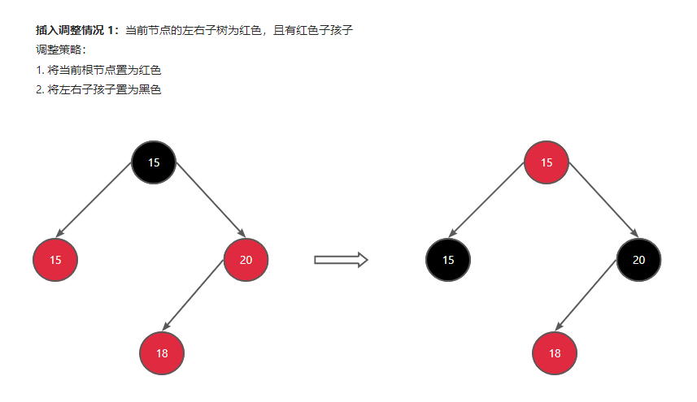
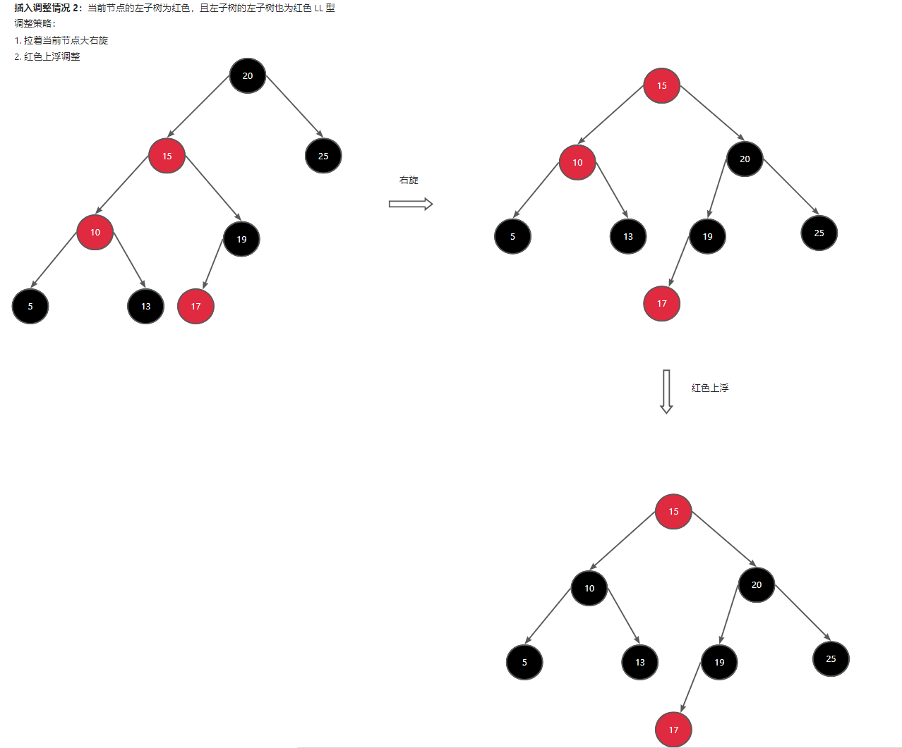
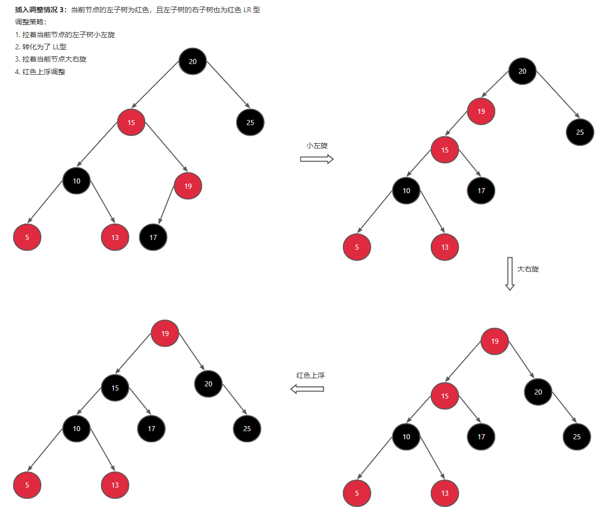

# 常用数据结构封装

## 堆

::: code-group

```js [小顶堆]
class MinHeap {
  constructor() {
    this.heap = [];
  }

  /**
   * 插入元素
   */
  insert(val) {
    this.heap.push(val);
    this.__heapifyUp(this.size() - 1);
  }

  /**
   * 删除堆顶元素
   */
  pop() {
    if (this.isEmpty()) return null;

    const top = this.heap[0];
    const last = this.heap.pop();

    if (this.size() > 0) {
      this.heap[0] = last;
      this.__heapifyDown(0);
    }

    return top;
  }

  /**
   * 获取堆顶元素
   */
  peek() {
    if (this.isEmpty()) return null;

    return this.heap[0];
  }

  /**
   * 返回堆的大小
   */
  size() {
    return this.heap.length;
  }

  /**
   * 判断堆是否为空
   */
  isEmpty() {
    return this.size() === 0;
  }

  /**
   * 获取父节点的索引
   */
  __getParentIndex(index) {
    return Math.floor((index - 1) / 2);
  }

  /**
   * 获取左子节点的索引
   */
  __getLeftChildIndex(index) {
    return 2 * index + 1;
  }

  /**
   * 获取右子节点的索引
   */
  __getRightChildIndex(index) {
    return 2 * index + 2;
  }

  /**
   * 交换两个节点的值
   */
  __swap(i, j) {
    [this.heap[i], this.heap[j]] = [this.heap[j], this.heap[i]];
  }

  /**
   * 向上调整，插入元素时使用
   */
  __heapifyUp(index) {
    while (index > 0) {
      const parentIndex = this.__getParentIndex(index);
      if (this.heap[parentIndex] <= this.heap[index]) break;
      this.__swap(index, parentIndex);
      index = parentIndex;
    }
  }

  /**
   * 向下调整，删除堆顶元素时使用
   */
  __heapifyDown(index) {
    // 左子节点
    const leftIndex = this.__getLeftChildIndex(index);
    // 右子节点
    const rightIndex = this.__getRightChildIndex(index);
    // 三者找最小
    let minIndex = index;

    if (leftIndex < this.size() && this.heap[leftIndex] < this.heap[minIndex]) {
      minIndex = leftIndex;
    }

    if (
      rightIndex < this.size() &&
      this.heap[rightIndex] < this.heap[minIndex]
    ) {
      minIndex = rightIndex;
    }

    if (minIndex !== index) {
      this.__swap(index, minIndex);
      this.__heapifyDown(minIndex);
    }
  }
}
```

:::

## 并查集

::: code-group

```js [染色法 QuickFind]
class QuickFind {
  constructor(n) {
    this.colors = new Array(n).fill(0).map((_, i) => i);
  }

  find(x) {
    return this.colors[x];
  }

  union(x, y) {
    const xColor = this.find(x);
    const yColor = this.find(y);

    if (xColor === yColor) return;

    for (let i = 0; i < this.colors.length; i++) {
      if (this.colors[i] === xColor) {
        this.colors[i] = yColor;
      }
    }
  }

  connected(x, y) {
    return this.find(x) === this.find(y);
  }
}
```

```js [QuickUnion]
class QuickUnion {
  constructor(n) {
    this.parents = new Array(n).fill(0).map((_, i) => i);
  }

  find(x) {
    if (this.parents[x] !== x) {
      this.parents[x] = this.find(this.parents[x]);
    }
    return this.parents[x];
  }

  union(x, y) {
    const xRoot = this.find(x);
    const yRoot = this.find(y);

    if (xRoot === yRoot) return;

    this.parents[xRoot] = yRoot;
  }

  connected(x, y) {
    return this.find(x) === this.find(y);
  }
}
```

```js [路径压缩 QuickUnion]
class UnionFind {
  constructor(n) {
    this.parents = new Array(n).fill(0).map((_, i) => i);
  }

  find(x) {
    if (this.parents[x] !== x) {
      this.parents[x] = this.find(this.parents[x]);
    }
    return this.parents[x];
  }

  union(x, y) {
    const xRoot = this.find(x);
    const yRoot = this.find(y);

    if (xRoot === yRoot) return;

    this.parents[xRoot] = yRoot;
  }

  connected(x, y) {
    return this.find(x) === this.find(y);
  }
}
```

```js [带权(按秩优化) + 路径压缩 QuickUnion]
class UnionFind {
  constructor(n) {
    this.parent = Array.from({ length: n }, (_, i) => i);
    // 按秩优化
    this.rank = Array(n).fill(1);
  }

  find(x) {
    if (this.parent[x] === x) return x;
    // path compression 路径压缩
    return (this.parent[x] = this.find(this.parent[x]));
  }

  union(x, y) {
    const px = this.find(x);
    const py = this.find(y);
    if (px === py) return;
    if (this.rank[px] < this.rank[py]) {
      this.parent[px] = py;
      this.rank[py] += this.rank[px];
    } else {
      this.parent[py] = px;
      this.rank[px] += this.rank[py];
    }
  }

  connected(x, y) {
    return this.find(x) === this.find(y);
  }
}
```

:::

## 二叉搜索树

::: code-group

```js [面向过程封装]
class TreeNode {
  constructor(val, left = null, right = null) {
    this.val = val;
    this.left = left;
    this.right = right;
  }
}

/**
 * 在二叉搜索树中插入一个节点
 *
 * @param {TreeNode} root
 * @param {number} val
 * @return {TreeNode}
 */
function insert(root, val) {
  if (root === null) return new TreeNode(val);
  if (val === root.val) return root;
  if (val < root.val) root.left = insert(root.left, val);
  else if (val > root.val) root.right = insert(root.right, val);
  return root;
}

/**
 * 在二叉搜索树中查找一个节点
 */
function find(root, val) {
  if (root === null) return null;
  if (val === root.val) return root;
  if (val < root.val) return find(root.left, val);
  return find(root.right, val);
}

/**
 * 查找前驱节点
 */
function __findPredecessor(root) {
  let predecessor = root.left;
  while (predecessor.right !== null) {
    predecessor = predecessor.right;
  }
  return predecessor;
}

/**
 * 在二叉搜索树中删除一个节点
 *
 * @param {TreeNode} root
 * @param {number} val
 * @return {TreeNode}
 */
function remove(root, val) {
  if (root === null) return null;
  if (val < root.val) root.left = remove(root.left, val);
  else if (val > root.val) root.right = remove(root.right, val);
  else {
    // 处理度为 0 或 1 的节点
    if (root.left === null || root.right === null) {
      return root.left || root.right;
    }

    // 处理度为 2 的节点
    // 找到前驱节点或后继节点
    // 这里选择前驱节点
    const preNode = __findPredecessor(root);
    root.val = preNode.val;
    // 删除前驱节点
    root.left = remove(root.left, preNode.val);
  }
  return root;
}
```

```js [面向对象封装]
class TreeNode {
  constructor(val, left = null, right = null) {
    this.val = val;
    this.left = left;
    this.right = right;
  }
}

class BST {
  constructor() {
    this.root = null;
  }

  insert(val) {
    this.root = this._insert(this.root, val);
  }

  find(val) {
    return this._find(this.root, val);
  }

  remove(val) {
    this.root = this._remove(this.root, val);
  }

  _insert(root, val) {
    if (root === null) return new TreeNode(val);
    if (val === root.val) return root;
    if (val < root.val) root.left = this._insert(root.left, val);
    else if (val > root.val) root.right = this._insert(root.right, val);
    return root;
  }

  _find(root, val) {
    if (root === null) return null;
    if (val === root.val) return root;
    if (val < root.val) return this._find(root.left, val);
    return this._find(root.right, val);
  }

  _remove(root, val) {
    if (root === null) return null;
    if (val < root.val) root.left = this._remove(root.left, val);
    else if (val > root.val) root.right = this._remove(root.right, val);
    else {
      // 处理度为 0 或 1 的节点
      if (root.left === null || root.right === null) {
        return root.left || root.right;
      }

      // 处理度为 2 的节点
      // 找到前驱节点或后继节点
      // 这里选择前驱节点
      const preNode = __findPredecessor(root);
      root.val = preNode.val;
      // 删除前驱节点
      root.left = this._remove(root.left, preNode.val);
    }
    return root;
  }

  __findPredecessor(root) {
    let predecessor = root.left;
    while (predecessor.right !== null) {
      predecessor = predecessor.right;
    }
    return predecessor;
  }
}
```

:::

## 红黑树

### 插入调整

1. **插入调整情况 1**

   当前节点的左右子树为红色，且有红色子孩子

   调整策略：

- 将当前根节点置为红色
- 将左右子孩子置为黑色



2. **插入调整情况 2**

当前节点的左子树为红色，且左子树的左子树也为红色 LL 型

调整策略：

- 拉着当前节点大右旋
- 红色上浮调整



3. **插入调整情况 3**

当前节点的左子树为红色，且左子树的右子树也为红色 LR 型

调整策略：

- 拉着当前节点的左子树小左旋
- 转化为了 LL 型
- 拉着当前节点大右旋
- 红色上浮调整



4. **插入调整情况 4**

RR 型 同 LL 型

5. **插入调整情况 5**

RL 型 同 LR 型

::: code-group

```js [红黑树]
/**
 * 红黑树：一种自平衡二叉搜索树，每个节点包含一个颜色属性，可以是红色或黑色。
 * 红黑树满足以下性质：
 * 1. 每个节点要么是红色，要么是黑色。
 * 2. 根节点是黑色。
 * 3. 每个叶子节点（NIL节点，空节点）是黑色。
 * 4. 如果一个节点是红色的，则它的两个子节点都是黑色的。
 * 5. 从任一节点到其每个叶子的所有路径都包含相同数目的黑色节点。
 * 这些性质确保了红黑树的高度大约是log(n)，从而保证了操作的时间复杂度。
 * 红黑树支持插入、删除和查找操作，这些操作的时间复杂度都是O(log(n))。
 * 红黑树广泛应用于数据库、文件系统、路由器等场景中。
 */
class RedBlackTreeNode {
  static NIL = new RedBlackTreeNode(0, 1); // 哨兵节点，颜色为黑色
  static RED = 0;
  static BLACK = 1;
  static DOUBLE_BLACK = 2;

  static getNewNode(val) {
    return new RedBlackTreeNode(val, RedBlackTreeNode.RED);
  }

  constructor(
    val,
    color,
    left = RedBlackTreeNode.NIL,
    right = RedBlackTreeNode.NIL
  ) {
    this.val = val;
    this.color = color; // 0 red 1 black 2 double black
    this.left = left;
    this.right = right;
  }
}

class RedBlackTree {
  constructor() {
    this.root = RedBlackTreeNode.NIL;
  }

  insert(val) {
    this.root = this.__insert(this.root, val);
    this.root.color = RedBlackTreeNode.BLACK;
    return this.root;
  }

  clear() {
    this.root = RedBlackTreeNode.NIL;
  }

  output() {
    console.log("============ print tree ============");
    this.__print(this.root);
    console.log("============ print tree done ============");
  }

  __print(root) {
    if (root === RedBlackTreeNode.NIL) return;
    console.log(root.val, root.color, root.left.val, root.right.val);
    this.__print(root.left);
    this.__print(root.right);
  }

  /**
   * @description 插入
   * @param {RedBlackTreeNode} root
   * @param {number} val
   * @returns
   */
  __insert(root, val) {
    if (root === RedBlackTreeNode.NIL) return RedBlackTreeNode.getNewNode(val);
    if (val === root.val) return root;
    if (val < root.val) root.left = this.__insert(root.left, val);
    else root.right = this.__insert(root.right, val);

    return this.__insert_maintain(root); // 平衡调整
  }

  /**
   * @description 平衡调整
   * @param {RedBlackTreeNode} root
   * @returns
   */
  __insert_maintain(root) {
    // 站在祖父节点向下看
    // 是否冲突的判断条件
    // 左子树为红色，且左子树的孩子节点也是红色
    let flag = 0; // 0 无冲突 1 左冲突 2 右冲突
    if (
      root.left.color === RedBlackTreeNode.RED &&
      this.__has_red_child(root.left)
    ) {
      flag = 1;
    }

    if (
      root.right.color === RedBlackTreeNode.RED &&
      this.__has_red_child(root.right)
    ) {
      flag = 2;
    }

    if (flag === 0) return root; // 无冲突，直接返回

    // 一定是冲突了
    // TODO:

    // 插入调整的情况 I
    if (
      root.left.color === RedBlackTreeNode.RED &&
      root.right.color === RedBlackTreeNode.RED
    ) {
      // 根变红色，左右子节点变黑色
      root.color = RedBlackTreeNode.RED;
      root.left.color = RedBlackTreeNode.BLACK;
      root.right.color = RedBlackTreeNode.BLACK;
      return root;
    }

    // 插入调整的情况 II
    if (flag === 1) {
      // 冲突在左子树 L-类型
      // 是否需要小左旋，L-R 类型需要先左旋，再右旋
      if (root.left.right.color === RedBlackTreeNode.RED) {
        root.left = this.__left_rotate(root.left);
      }
      root = this.__right_rotate(root);
    } else {
      // 冲突在右子树 R-类型
      // 是否需要小右旋，R-L 类型需要先右旋，再左旋
      if (root.right.left.color === RedBlackTreeNode.RED) {
        root.right = this.__right_rotate(root.right);
      }
      root = this.__left_rotate(root);
    }

    // 情况 II 中无论是哪种类型，都需要红色上浮调整或者红色下浮调整
    // 这里我们选择红色上浮
    root.color = RedBlackTreeNode.RED;
    root.left.color = RedBlackTreeNode.BLACK;
    root.right.color = RedBlackTreeNode.BLACK;
    return root;
  }

  __has_red_child(root) {
    return (
      root.left.color === RedBlackTreeNode.RED ||
      root.right.color === RedBlackTreeNode.RED
    );
  }

  __left_rotate(root) {
    // TODO: 左旋
    let temp = root.right;
    root.right = temp.left;
    temp.left = root;
    return temp;
  }

  __right_rotate(root) {
    // TODO: 右旋
    let temp = root.left;
    root.left = temp.right;
    temp.right = root;
    return temp;
  }
}
```

:::
