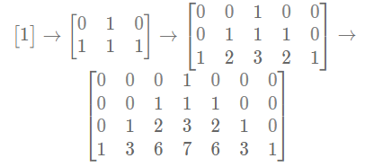

# 牛客刷题

## 华为

### [HJ3 明明的随机数](https://www.nowcoder.com/practice/3245215fffb84b7b81285493eae92ff0?tpId=37&rp=1&sourceUrl=%2Fexam%2Foj%2Fta%3Fpage%3D3%26tpId%3D37%26type%3D37&difficulty=&judgeStatus=&tags=&title=&gioEnter=menu) :white_check_mark:

**描述**
对于明明生成的 n 个 1 到 500 之间的随机整数，你需要帮助他完成以下任务：

- 删去重复的数字，即相同的数字只保留一个，把其余相同的数去掉；
- 然后再把这些数从小到大排序，按照排好的顺序输出。
  你只需要输出最终的排序结果。

**输入描述**
第一行为一个正整数 n (1≤n≤100)。
第二行有 n 个用空格隔开的整数，每个整数的范围为 [1,500]。

**输出描述**
输出一行从小到大排序后的结果，每个整数后面有一个空格。

**示例 1**

输入

```
3
2
2
1
```

输出

```
1
2
```

**代码**

```js
const rl = require("readline").createInterface({ input: process.stdin });
var iter = rl[Symbol.asyncIterator]();
const readline = async () => (await iter.next()).value;

void (async function () {
  // Write your code here
  let inputs = [];
  while ((line = await readline())) {
    inputs.push(line);
  }
  inputs = inputs.slice(1);
  inputs = [...new Set(inputs)];
  inputs.sort((a, b) => a - b);
  inputs.forEach(item => {
    console.log(`${item}`);
  });
})();
```

### [HJ17 坐标移动](https://www.nowcoder.com/practice/119bcca3befb405fbe58abe9c532eb29?tpId=37&rp=1&sourceUrl=%2Fexam%2Foj%2Fta%3Fpage%3D3%26tpId%3D37%26type%3D37&difficulty=&judgeStatus=&tags=&title=&gioEnter=menu) :white_check_mark:

```js
const rl = require("readline").createInterface({ input: process.stdin });
var iter = rl[Symbol.asyncIterator]();
const readline = async () => (await iter.next()).value;

const validOrder = order => {
  if (!order) return false;
  const regex = /^[A|W|S|D][0-9]{1,2}$/;
  return regex.test(order);
};

void (async function () {
  const line = await readline();
  const validateOrders = line
    .split(";")
    .filter(item => {
      return validOrder(item);
    })
    .map(o => {
      let action = o.charAt(0);
      let step = Number(o.slice(1));
      return { action, step };
    });
  let x = 0,
    y = 0;
  validateOrders.forEach(({ action, step }) => {
    switch (action) {
      case "A":
        x -= step;
        break;
      case "W":
        y += step;
        break;
      case "S":
        y -= step;
        break;
      case "D":
        x += step;
        break;
    }
  });
  console.log(`${x},${y}`);
})();
```

### [HJ18 识别有效的 IP 地址和掩码并进行分类统计](https://www.nowcoder.com/practice/de538edd6f7e4bc3a5689723a7435682?tpId=37&rp=1&sourceUrl=%2Fexam%2Foj%2Fta%3Fpage%3D3%26tpId%3D37%26type%3D37&difficulty=&judgeStatus=&tags=&title=&gioEnter=menu) :x:

### [HJ24 合唱队](https://www.nowcoder.com/practice/6d9d69e3898f45169a441632b325c7b4?tpId=37&rp=1&sourceUrl=%2Fexam%2Foj%2Fta%3Fpage%3D3%26tpId%3D37%26type%3D37&difficulty=&judgeStatus=&tags=&title=&gioEnter=menu) :white_check_mark:

#### 问题分析

我们需要找到一个最长的合唱队形，即一个先严格递增再严格递减的序列。换句话说，我们需要找到一个“山峰”位置 `i`，使得：

1. 在 `i` 左侧的所有同学身高严格递增（`h[1] < h[2] < ... < h[i]`）。
2. 在 `i` 右侧的所有同学身高严格递减（`h[i] > h[i+1] > ... > h[k]`）。

目标是让剩下的同学尽可能多，也就是需要删除的同学尽可能少。

#### 解题思路

1. **动态规划（DP）**：

   - 对于每个位置 `i`，计算以 `i` 为“山峰”的最长合唱队形长度。
   - 这可以分为两部分：
     - 从左到右的 **最长递增子序列（LIS）**，记录每个位置 `i` 左侧的最长递增序列长度。
     - 从右到左的 **最长递减子序列（LDS）**，记录每个位置 `i` 右侧的最长递减序列长度。
   - 合唱队形的长度为 `LIS[i] + LDS[i] - 1`（因为 `i` 被计算了两次）。
   - 最少需要删除的同学数为 `n - max(LIS[i] + LDS[i] - 1)`。

2. **算法步骤**：
   - 计算 `LIS` 数组：
     - `LIS[i]` 表示以 `h[i]` 结尾的最长严格递增子序列的长度。
     - 初始化 `LIS[i] = 1`（每个同学至少可以单独构成一个长度为 1 的序列）。
     - 对于每个 `i`，遍历 `j` 从 `0` 到 `i-1`，如果 `h[j] < h[i]`，则更新 `LIS[i] = max(LIS[i], LIS[j] + 1)`。
   - 计算 `LDS` 数组：
     - `LDS[i]` 表示以 `h[i]` 开头的最长严格递减子序列的长度。
     - 初始化 `LDS[i] = 1`。
     - 对于每个 `i`，从 `n-1` 反向遍历到 `i+1`，如果 `h[j] < h[i]`，则更新 `LDS[i] = max(LDS[i], LDS[j] + 1)`。
   - 遍历所有 `i`，计算 `max_len = max(LIS[i] + LDS[i] - 1)`。
   - 最少删除人数为 `n - max_len`。

#### 代码实现

```javascript
const readline = require("readline");

const rl = readline.createInterface({
  input: process.stdin,
  output: process.stdout
});

let n = 0;
let heights = [];

rl.on("line", function (line) {
  if (n === 0) {
    n = parseInt(line.trim());
  } else {
    heights = line.trim().split(" ").map(Number);
    solve();
    rl.close();
  }
});

function solve() {
  const LIS = new Array(n).fill(1);
  const LDS = new Array(n).fill(1);

  // 计算 LIS（从左到右）
  for (let i = 1; i < n; i++) {
    for (let j = 0; j < i; j++) {
      if (heights[j] < heights[i]) {
        LIS[i] = Math.max(LIS[i], LIS[j] + 1);
      }
    }
  }

  // 计算 LDS（从右到左）
  for (let i = n - 2; i >= 0; i--) {
    for (let j = n - 1; j > i; j--) {
      if (heights[j] < heights[i]) {
        LDS[i] = Math.max(LDS[i], LDS[j] + 1);
      }
    }
  }

  let max_len = 0;
  for (let i = 0; i < n; i++) {
    max_len = Math.max(max_len, LIS[i] + LDS[i] - 1);
  }

  console.log(n - max_len);
}
```

#### 代码解释

1. **输入处理**：

   - 使用 `readline` 读取输入，第一行是同学数量 `n`，第二行是身高数组 `heights`。

2. **动态规划数组初始化**：

   - `LIS` 和 `LDS` 初始化为全 1 数组，表示每个同学至少可以单独构成长度为 1 的序列。

3. **计算 LIS**：

   - 从左到右遍历，对于每个 `i`，检查所有 `j < i`，如果 `h[j] < h[i]`，则更新 `LIS[i]`。

4. **计算 LDS**：

   - 从右到左遍历，对于每个 `i`，检查所有 `j > i`，如果 `h[j] < h[i]`，则更新 `LDS[i]`。

5. **计算最长合唱队形**：

   - 遍历所有 `i`，计算 `LIS[i] + LDS[i] - 1` 的最大值 `max_len`。

6. **输出结果**：
   - 最少删除人数为 `n - max_len`。

#### 示例解析

**输入**：

```
8
186 186 150 200 160 130 197 200
```

**计算过程**：

- `LIS`（从左到右）：`[1, 1, 1, 2, 2, 1, 3, 4]`
- `LDS`（从右到左）：`[3, 3, 2, 3, 2, 1, 1, 1]`
- `LIS + LDS - 1`：`[3, 3, 2, 4, 3, 1, 3, 4]`
- `max_len = 4`
- 最少删除人数：`8 - 4 = 4`。

#### 复杂度分析

- **时间复杂度**：O(n²)，因为需要两层循环计算 `LIS` 和 `LDS`。
- **空间复杂度**：O(n)，用于存储 `LIS` 和 `LDS` 数组。

### [HJ29 字符串加解密](https://www.nowcoder.com/practice/2aa32b378a024755a3f251e75cbf233a?tpId=37&rp=1&sourceUrl=%2Fexam%2Foj%2Fta%3Fpage%3D3%26tpId%3D37%26type%3D37&difficulty=&judgeStatus=&tags=&title=&gioEnter=menu) :white_check_mark:

```js
const rl = require("readline").createInterface({ input: process.stdin });
var iter = rl[Symbol.asyncIterator]();
const readline = async () => (await iter.next()).value;

void (async function () {
  const inputs = [];
  // Write your code here
  while ((line = await readline())) {
    inputs.push(line);
  }
  console.log(encrypt(inputs[0])); // 加密
  console.log(deencrypt(inputs[1])); // 解密
})();

/**
 * 加密字符串
 * @param {string} s
 * @returns {string}
 */
function encrypt(s) {
  let str = s;
  str = str.replace(/[a-zA-Z0-9]/g, match => {
    if (/[a-z]/.test(match)) {
      // 小写
      if (match === "z") return "A";
      return String.fromCharCode(
        match.toUpperCase().charCodeAt() + 1
      ).toUpperCase();
    } else if (/[A-Z]/.test(match)) {
      // 大写
      if (match === "Z") return "a";
      return String.fromCharCode(
        match.toLowerCase().charCodeAt() + 1
      ).toLowerCase();
    } else {
      return match === "9" ? 0 : Number(match) + 1;
    }
  });
  return str;
}

/**
 * 解密字符串
 * @param {string} s
 * @returns {string}
 */
function deencrypt(s) {
  let str = s;
  str = str.replace(/[a-zA-Z0-9]/g, match => {
    if (/[a-z]/.test(match)) {
      // 小写
      if (match === "a") return "Z";
      return String.fromCharCode(
        match.toUpperCase().charCodeAt() - 1
      ).toUpperCase();
    } else if (/[A-Z]/.test(match)) {
      // 大写
      if (match === "A") return "z";
      return String.fromCharCode(
        match.toLowerCase().charCodeAt() - 1
      ).toLowerCase();
    } else {
      return match === "0" ? 9 : Number(match) - 1;
    }
  });
  return str;
}
```

### [HJ30 字符串合并处理](https://www.nowcoder.com/practice/d3d8e23870584782b3dd48f26cb39c8f?tpId=37&rp=1&sourceUrl=%2Fexam%2Foj%2Fta%3Fpage%3D3%26tpId%3D37%26type%3D37&difficulty=&judgeStatus=&tags=&title=&gioEnter=menu) :white_check_mark:

```js
const rl = require("readline").createInterface({ input: process.stdin });
var iter = rl[Symbol.asyncIterator]();
const readline = async () => (await iter.next()).value;

void (async function () {
  // Write your code here
  while ((line = await readline())) {
    const [s, t] = line.trim().split(" ");
    console.log(formatStr(mergeStr(s, t)));
  }
})();

function mergeStr(s, t) {
  let u = s + t;
  const arr = u.split("");
  const even = arr.filter((_, ind) => ind % 2 !== 0);
  const odd = arr.filter((_, ind) => ind % 2 === 0);
  odd.sort();
  even.sort();
  arr.length = 0;
  while (odd.length || even.length) {
    const a = odd.shift();
    const b = even.shift();
    if (!b) {
      arr.push(a);
    } else {
      arr.push(a);
      arr.push(b);
    }
  }
  return arr.join("");
}

function formatStr(s) {
  let result = "";
  for (const c of s) {
    if (!/[a-fA-F0-9]/.test(c)) {
      result += c;
    } else {
      let decimal = parseInt(c, 16);
      let binary = decimal
        .toString(2)
        .padStart(4, "0")
        .split("")
        .reverse()
        .join("");
      result += parseInt(binary, 2).toString(16).toUpperCase();
    }
  }
  return result;
}
```

### [HJ37 统计每个月兔子的总数](https://www.nowcoder.com/practice/1221ec77125d4370833fd3ad5ba72395?tpId=37&tqId=21260&rp=1&sourceUrl=%2Fexam%2Foj%2Fta%3Fdifficulty%3D2%26judgeStatus%3D3%26page%3D1%26pageSize%3D50%26search%3D%26tpId%3D37%26type%3D37&difficulty=2&judgeStatus=3&tags=&title=) :white_check_mark:

#### 描述

有一只兔子，从出生后第 3 个月起每个月都生一只兔子，小兔子长到第三个月后每个月又生一只兔子，假如兔子都不死，问第 n 个月兔子的总数为多少？

#### 输入描述：

输入 int 型一个 n。

#### 输出描述：

输出 n 个月后的兔子总数。

#### 示例 1

输入：

```
3
```

输出：

```
3
```

#### 解题思路：

1. 第`i`个月兔子的总数 = 第`i - 1`兔子的总数 + 新出生的兔子数量
2. `i - 2, i - 1, i`
3. 由于差三个月，且兔子从出生后的第三个月起，都会出生一只兔子
4. 所以在 `i - 2` 出生的兔子，在第 `i` 个月也会出生兔子
5. 故 `dp[i] = dp[i - 1] + dp[i - 2];`

#### 代码实现：

```js
const rl = require("readline").createInterface({ input: process.stdin });
var iter = rl[Symbol.asyncIterator]();
const readline = async () => (await iter.next()).value;

void (async function () {
  // Write your code here
  while ((line = await readline())) {
    const n = Number(line);
    console.log(getTotalRabbit(n));
  }
})();

function getTotalRabbit(n) {
  if (n <= 0) return 0;
  if (n === 1 || n === 2) return 1;
  let dp = [0, 1, 1];
  for (let i = 3; i <= n; i++) {
    dp[i] = dp[i - 1] + dp[i - 2];
  }
  return dp[n];
}
```

### [HJ52 计算字符串的编辑距离](https://www.nowcoder.com/practice/3959837097c7413a961a135d7104c314?tpId=37&rp=1&sourceUrl=%2Fexam%2Foj%2Fta%3Fpage%3D3%26tpId%3D37%26type%3D37&difficulty=&judgeStatus=&tags=&title=&gioEnter=menu) :x:

### [HJ53 杨辉三角的变形](https://www.nowcoder.com/practice/8ef655edf42d4e08b44be4d777edbf43?tpId=37&tqId=21276&rp=1&sourceUrl=%2Fexam%2Foj%2Fta%3Fdifficulty%3D2%26judgeStatus%3D3%26page%3D1%26pageSize%3D50%26search%3D%26tpId%3D37%26type%3D37&difficulty=2&judgeStatus=3&tags=&title=) :white_check_mark:

1. **描述**

定义变形的杨辉三角规则：

- 第一行为固定的整数 1
- 第二行开始，每行的数字数量均比上一行多两个，且中心对称（也可以看作是在上一行的基础上首尾增加了一个数字）；每个位置上的数字是它正上方、左上角和右上角这三个数之和（如果不存在某个数，认为该数就是 0）。
  下方展示了计算的过程：
  
  现在，你需要输出第 n 行中第一个偶数出现的位置。从 1 开始计数。

2. **输入描述：**
   输入一个整数 n（1 ≤ n ≤ 10^9）代表询问的行数。

3. **输出描述：**
   输出一个整数代表第 n 行第一个偶数出现的位置。

4. **示例 1**

输入：

```
4
```

输出：

```
3
```

**代码**

::: code-group

```js [构造数组（超出内存限制）]
const rl = require("readline").createInterface({ input: process.stdin });
var iter = rl[Symbol.asyncIterator]();
const readline = async () => (await iter.next()).value;

void (async function () {
  // Write your code here
  while ((line = await readline())) {
    const n = parseInt(line.trim());
    if (n === 1) {
      console.log(-1);
      continue;
    }
    const arr = buildTriangle(n);
    for (let i = 0; i < arr.length; i++) {
      let num = arr[i];
      if (num % 2 === 0) {
        console.log(i + 1);
        return;
      }
    }
    console.log(-1);
  }
})();

/**
 * 创建 n 行的杨辉三角变形
 */
function buildTriangle(n) {
  let colCount = 2 * n - 1;
  const arr = new Array(n).fill(0).map(() => new Array(colCount).fill(0));
  arr[0][colCount >> 1] = 1;

  for (let i = 1; i < n; i++) {
    for (j = 0; j < colCount; j++) {
      let left = j === 0 ? 0 : arr[i - 1][j - 1];
      let top = arr[i - 1][j];
      let right = j === colCount - 1 ? 0 : arr[i - 1][j + 1];
      arr[i][j] = left + top + right;
    }
  }
  return arr[n - 1];
}
```

```js [构造数组-滚动数组（运行超时）]
const rl = require("readline").createInterface({ input: process.stdin });
var iter = rl[Symbol.asyncIterator]();
const readline = async () => (await iter.next()).value;

void (async function () {
  // Write your code here
  while ((line = await readline())) {
    const n = parseInt(line.trim());
    if (n === 1) {
      console.log(-1);
      continue;
    }
    const arr = buildTriangle(n);
    for (let i = 0; i < arr.length; i++) {
      let num = arr[i];
      if (num % 2 === 0) {
        console.log(i + 1);
        return;
      }
    }
    console.log(-1);
  }
})();

/**
 * 创建 n 行的杨辉三角变形
 */
function buildTriangle(n) {
  let colCount = 2 * n - 1;
  let preArr = new Array(colCount).fill(0);
  let nextArr = new Array(colCount).fill(0);

  preArr[colCount >> 1] = 1;

  for (let i = 1; i < n; i++) {
    for (j = 0; j < colCount; j++) {
      let left = j === 0 ? 0 : preArr[j - 1];
      let top = preArr[j];
      let right = j === colCount - 1 ? 0 : preArr[j + 1];
      nextArr[j] = left + top + right;
    }
    preArr = [...nextArr];
  }
  return nextArr;
}
```

```js [数学思维-找规律]
// 这个问题要求我们找到变形杨辉三角第 n 行中第一个偶数的位置。由于 n 可以达到 10^9，
// 直接计算整个三角形是不现实的，我们需要找到数学规律。前面尝试均以内存超限和运行
// 超时结束，因此需要寻找更高效的解决方案。

// 通过观察变形杨辉三角的前几行，我们可以发现以下模式：
// 第 1 行: [1] → 无偶数 → -1
// 第 2 行: [1,1,1] → 无偶数 → -1
// 第 3 行: [1,2,3,2,1] → 第一个偶数 2 在位置 2
// 第 4 行: [1,3,6,7,6,3,1] → 第一个偶数 6 在位置 3
// 第 5 行: [1,4,10,16,19,16,10,4,1] → 第一个偶数 4 在位置 2
// 第 6 行: [1,5,15,30,45,51,45,30,15,5,1] → 第一个偶数 30 在位置 4

// 从这些观察中，我们可以得出以下规律：
// 当 n ≤ 2时，没有偶数，返回 -1
// 当 n > 2时，第一个偶数的位置遵循特定模式：
//    如果 n 是奇数，第一个偶数位置是2
//    如果 n 是偶数且 n/2 是奇数，第一个偶数位置是 n/2
//    如果 n 是偶数且 n/2 是偶数，第一个偶数位置是 3
const rl = require("readline").createInterface({ input: process.stdin });
var iter = rl[Symbol.asyncIterator]();
const readline = async () => (await iter.next()).value;

void (async function () {
  // Write your code here
  while ((line = await readline())) {
    const n = parseInt(line.trim());
    if (n <= 2) console.log(-1);
    else if (n % 2 !== 0) console.log(2);
    else {
      if ((n / 2) % 2 === 0) console.log(3);
      else console.log(4);
    }
  }
})();
```

:::

### [HJ61 放苹果](https://www.nowcoder.com/practice/bfd8234bb5e84be0b493656e390bdebf?tpId=37&rp=1&sourceUrl=%2Fexam%2Foj%2Fta%3Fpage%3D3%26tpId%3D37%26type%3D37&difficulty=&judgeStatus=&tags=&title=&gioEnter=menu) :white_check_mark:

1. **描述**

把 m 个同样的苹果放在 n 个同样的盘子里，允许有的盘子空着不放，问共有多少种不同的分法？
注意：如果有 7 个苹果和 3 个盘子，（5，1，1）和（1，5，1）被视为是同一种分法。

2. **输入描述：**

输入苹果的个数 m 和盘子的个数 n，其中 1 <= m,n <= 10。

3. **输出描述：**

输出不同的分法数。

4. **示例 1**

输入：

```
7 3
```

输出：

```
8
```

**代码**

```js
const rl = require("readline").createInterface({ input: process.stdin });
var iter = rl[Symbol.asyncIterator]();
const readline = async () => (await iter.next()).value;

void (async function () {
  const [m, n] = (await readline()).trim().split(" ").map(Number);
  console.log(setApples(m, n));
})();

/**
 * 返回：将 m 个 苹果放入 n 个盘子中的分发数量
 */
function setApples(m, n) {
  if (m === 0 || n === 1) {
    // 没有苹果，只有一种分发，所有盘子为空
    // 只有一个盘子，只有一种分发，所有苹果放入该盘子
    return 1;
  }
  if (m < n) {
    // 苹果少，最多用 m 个盘子，每个盘子放一个，其余盘子为空
    return setApples(m, m);
  } else {
    // 1. 互斥性：两种子问题没有重叠情况
    //    1.1 "至少一个盘子为空"包含所有有空盘子的分法。
    //    1.2 "所有盘子不为空"包含没有空盘子的分法。
    // 2. 完备性：所有可能的分法都被覆盖
    //    2.1 任意分法要么有空盘子，要么所有盘子非空。
    // 苹果多的情况下，可以放满盘子
    // 分发分解为有空盘和无空盘两种情况
    // 至少一个盘子为空 + 所有盘子不为空

    // 这种分解确保了：
    // 不重复：两种子问题互斥。
    // 不遗漏：覆盖所有可能的分法。
    // 逐步简化：通过递归将问题规模缩小到基本情况。
    return setApples(m, n - 1) + setApples(m - n, n);
  }
}
```

### [HJ64 MP3 光标位置](https://www.nowcoder.com/practice/eaf5b886bd6645dd9cfb5406f3753e15?tpId=37&rp=1&sourceUrl=%2Fexam%2Foj%2Fta%3Fpage%3D3%26tpId%3D37%26type%3D37&difficulty=&judgeStatus=&tags=&title=&gioEnter=menu) :white_check_mark:

### [HJ67 24 点游戏算法](https://www.nowcoder.com/practice/fbc417f314f745b1978fc751a54ac8cb?tpId=37&rp=1&sourceUrl=%2Fexam%2Foj%2Fta%3Fpage%3D1%26tpId%3D37%26type%3D37&difficulty=&judgeStatus=&tags=&title=&gioEnter=menu) :x:

1. **描述**

给出 4 个 1~10 的数字，通过加减乘除运算，得到数字 24，算式中的数字可以重复使用，且每个数字只能使用一次，运算符包括加(+)、减(-)、乘(\*)、除(/)。

2. **输入描述：**

输入共一行，包含四个空格隔开的整数 A、B、C、D，分别代表给定的 4 个数字（1 <= A、B、C、D <= 10）。

3. **输出描述：**

输出一行，如果存在能得到 24 的算式，则输出 Yes，否则输出 No。

4. **示例 1**

输入：

```js
4 1 8 7
```

输出：

```
Yes
```

**代码**

```js

```

### [HJ68 成绩排序](https://www.nowcoder.com/practice/8e400fd9905747e4acc2aeed7240978b?tpId=37&rp=1&sourceUrl=%2Fexam%2Foj%2Fta%3Fpage%3D3%26tpId%3D37%26type%3D37&difficulty=&judgeStatus=&tags=&title=&gioEnter=menu) :white_check_mark:

### [HJ85 最长回文子串](https://www.nowcoder.com/practice/12e081cd10ee4794a2bd70c7d68f5507?tpId=37&tqId=21308&rp=1&sourceUrl=%2Fexam%2Foj%2Fta%3Fdifficulty%3D2%26judgeStatus%3D3%26page%3D1%26pageSize%3D50%26search%3D%26tpId%3D37%26type%3D37&difficulty=2&judgeStatus=3&tags=&title=) :white_check_mark:

1. **描述**

给定一个仅包含小写字母的字符串，求它的最长回文子串的长度。

2. **输入描述：**

输入一个字符串，长度不超过 1000，字符串中的字符仅由小写字母组成。

3. **输出描述：**

输出一个整数，表示最长回文子串的长度。

4. **示例 1**
   输入：

```
abc1234321abc
```

输出：

```
7
```

**代码**

::: code-group

```js [暴力法]
const rl = require("readline").createInterface({ input: process.stdin });
var iter = rl[Symbol.asyncIterator]();
const readline = async () => (await iter.next()).value;

void (async function () {
  const str = await readline();
  console.log(longestPalindrome(str));
})();

/**
 * 返回：字符串 s 的最长回文子串的长度
 * 时间复杂度 O(n^3)
 * 空间复杂度 O(1)
 */
function longestPalindrome(s) {
  const n = s.length;
  if (n < 2) return n;
  let maxLen = 1;
  for (let i = 0; i < n; i++) {
    for (let j = i + 1; j < n; j++) {
      if (j - i + 1 > maxLen && isPalindrome(s, i, j)) {
        maxLen = j - i + 1;
      }
    }
  }
  return maxLen;
}

/**
 * 返回：字符串 s 在区间 [left, right] 是否是回文串
 */
function isPalindrome(s, left, right) {
  while (left < right) {
    if (s[left] !== s[right]) {
      return false;
    }
    left++;
    right--;
  }
  return true;
}
```

```js [动态规划+滑动窗口]
const rl = require("readline").createInterface({ input: process.stdin });
var iter = rl[Symbol.asyncIterator]();
const readline = async () => (await iter.next()).value;

void (async function () {
  const str = await readline();
  console.log(longestPalindrome(str));
})();

/**
 * 返回：字符串 s 的最长回文子串的长度
 * 
 * 时间复杂度 O(n^2)
 * 空间复杂度 O(n^2)
 */
function longestPalindrome(s) {
  // dp[i][j] 表示 i 到 j 的子串是否是回文串
  // dp[i][i] = true 长度为 1 的字串是回文串
  const n = s.length;
  const dp = Array.from({ length: n }, () => new Array(n).fill(false));

  let maxLen = 1;
  // 长度为 1 的字串是回文串
  for (let i = 0; i < n; i++) dp[i][i] = true;

  // 处理长度为 2 的子串
  for (let i = 0; i < n - 1; i++) {
    if (s[i] === s[i + 1]) {
      dp[i][i + 1] = true;
      maxLen = 2;
    }
  }

  // 处理长度大于 3 的子串
  for (let len = 3; len <= n; len++) {
    for (let i = 0; i < n - len + 1; i++) {
      let j = i + len - 1;
      // 收尾相同且内部是子串，则该子串是回文串
      if (s[i] === s[j] && dp[i + 1][j - 1]) {
        dp[i][j] = true;
        maxLen = Math.max(maxLen, j - i + 1);
      }
    }
  }
  return maxLen;
}
```

```js [动态规划+从左到右单侧扩展]
const rl = require("readline").createInterface({ input: process.stdin });
var iter = rl[Symbol.asyncIterator]();
const readline = async () => (await iter.next()).value;

void (async function () {
  const str = await readline();
  console.log(longestPalindrome(str));
})();

/**
 * 返回：字符串 s 的最长回文子串的长度
 * 
 * 时间复杂度 O(n^2)
 * 空间复杂度 O(n^2)
 */
function longestPalindrome(s) {
  const n = s.length;
  if (n < 2) return n;
  const dp = Array.from({ length: n }, () => Array(n).fill(false));
  let maxLen = 1;
  for (let i = 0; i < n; i++) {
    dp[i][i] = true;
  }
  for (let j = 1; j < n; j++) {
    for (let i = 0; i < j; i++) {
      if (s[i] !== s[j]) {
        dp[i][j] = false;
      } else {
        if (j - i < 3) {
          dp[i][j] = true;
        } else {
          dp[i][j] = dp[i + 1][j - 1];
        }
      }
      if (dp[i][j]) {
        maxLen = Math.max(maxLen, j - i + 1);
      }
    }
  }
  return maxLen;
}
```

```js [中心扩展算法]
const rl = require("readline").createInterface({ input: process.stdin });
var iter = rl[Symbol.asyncIterator]();
const readline = async () => (await iter.next()).value;

void (async function () {
  const str = await readline();
  console.log(longestPalindrome(str));
})();

/**
 * 返回：字符串 s 的最长回文子串的长度
 * 
 * 时间复杂度 O(n^2)
 * 空间复杂度 O(1)
 */
function longestPalindrome(s) {
  if (s.length < 2) return s.length;
  let maxLen = 1;
  for (let i = 0; i < s.length; i++) {
    // 奇数长度的回文串
    let l = i - 1,
      r = i + 1;
    while (l >= 0 && r < s.length && s[l] === s[r]) {
      maxLen = Math.max(maxLen, r - l + 1);
      l--;
      r++;
    }
    // 偶数长度的回文串
    l = i;
    r = i + 1;
    while (l >= 0 && r < s.length && s[l] === s[r]) {
      maxLen = Math.max(maxLen, r - l + 1);
      l--;
      r++;
    }
  }
  return maxLen;
}
```

:::
