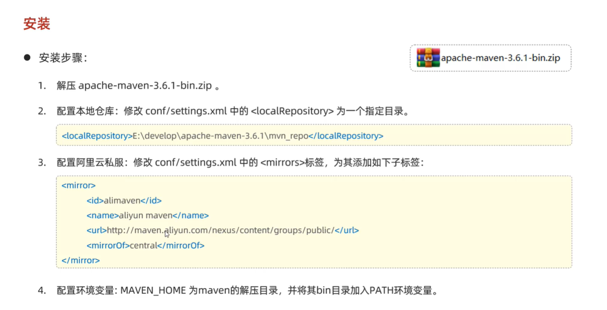
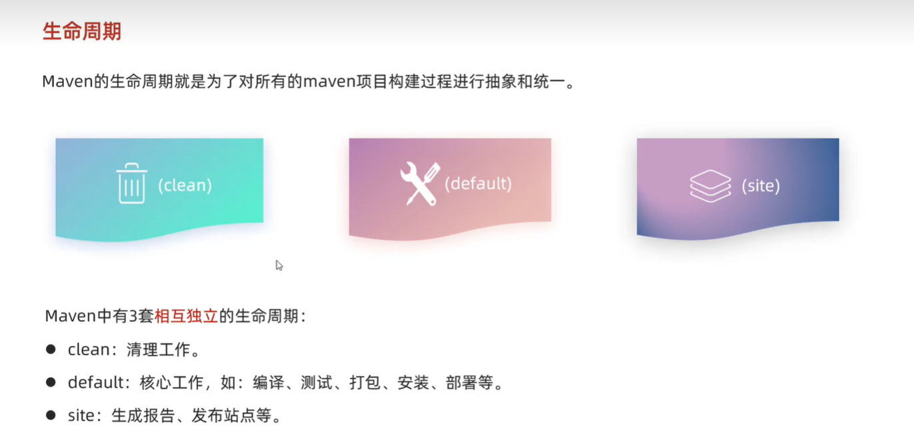
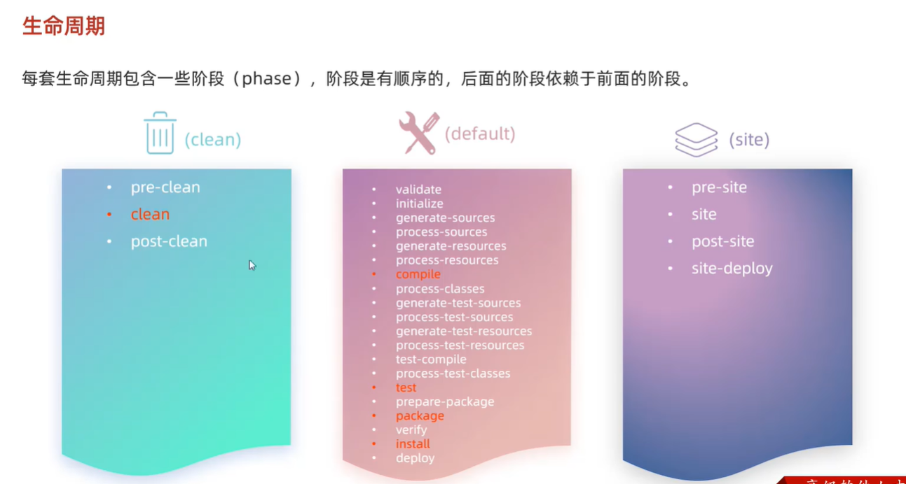
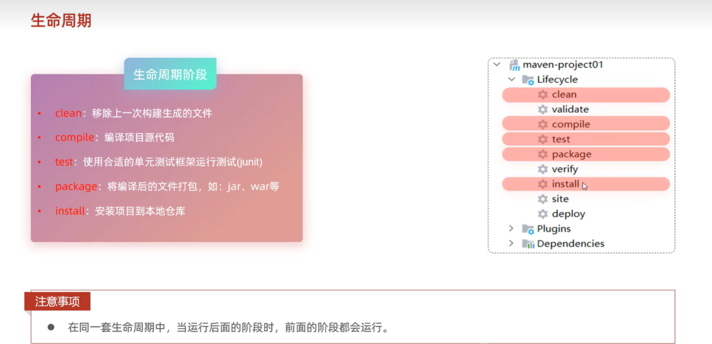
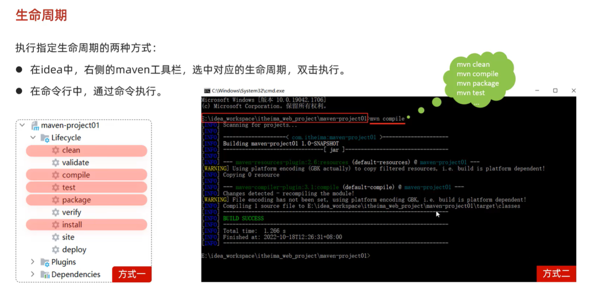

# 学习随笔记录

## 2025-09-2

### 黑马 JavaWeb 教程

1. b 标签：`<b>` 加粗
2. strong 标签：`<strong>` 加粗，语义更重，表示强调
3. js DOM 的事件绑定

- 通过 HTML 标签属性绑定

```html
<button onclick="alert('hello')">按钮</button>
```

- 通过 DOM 元素属性绑定

```html
<button id="btn">按钮</button>
<script>
  document.getElementById("btn").onclick = function () {
    alert("hello");
  };
</script>
```

4. 常见的事件

- onload：页面加载完成事件
- onclick：单击事件
- onfocus：获取焦点事件
- onblur：失去焦点事件
- onmouseover：鼠标悬停事件
- onmouseout：鼠标移出事件
- onmousemove：鼠标移动事件
- onmousedown：鼠标按下事件
- onmouseup：鼠标松开事件
- onsubmit：表单提交事件

5. Ajax(Asynchronous JavaScript and XML) 异步的 JavaScript 和 XML
6. Maven 的作用？

- 依赖管理：方便快捷的管理项目依赖的资源（jar 包），避免版本冲突问题
- 统一项目结构：提供标准、统一的项目结构
- 项目构建：标准跨平台（Linux、Windows、MacOS）的自动化项目构建方式
  总结：Maven 是一款管理和构建 Java 项目的工具。

7. POM(Project Object Model) 项目对象模型
8. Maven 安装
   
9. 依赖范围
   
10. 生命周期
    
    
    
    
