# 学习随笔记录

## 2025-09-02

### 黑马 JavaWeb 教程

1. b 标签：`<b>` 加粗
2. strong 标签：`<strong>` 加粗，语义更重，表示强调
3. js DOM 的事件绑定

- 通过 HTML 标签属性绑定

```html
<button onclick="alert('hello')">按钮</button>
```

- 通过 DOM 元素属性绑定

```html
<button id="btn">按钮</button>
<script>
  document.getElementById("btn").onclick = function () {
    alert("hello");
  };
</script>
```

4. 常见的事件

- onload：页面加载完成事件
- onclick：单击事件
- onfocus：获取焦点事件
- onblur：失去焦点事件
- onmouseover：鼠标悬停事件
- onmouseout：鼠标移出事件
- onmousemove：鼠标移动事件
- onmousedown：鼠标按下事件
- onmouseup：鼠标松开事件
- onsubmit：表单提交事件

5. Ajax(Asynchronous JavaScript and XML) 异步的 JavaScript 和 XML
6. Maven 的作用？

- 依赖管理：方便快捷的管理项目依赖的资源（jar 包），避免版本冲突问题
- 统一项目结构：提供标准、统一的项目结构
- 项目构建：标准跨平台（Linux、Windows、MacOS）的自动化项目构建方式
  总结：Maven 是一款管理和构建 Java 项目的工具。

7. POM(Project Object Model) 项目对象模型
8. Maven 安装
   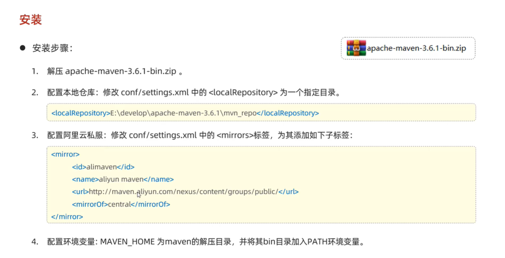
9. 依赖范围
   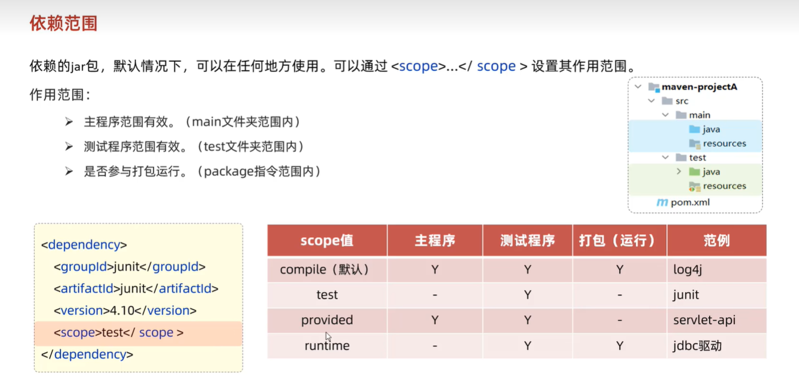
10. 生命周期
    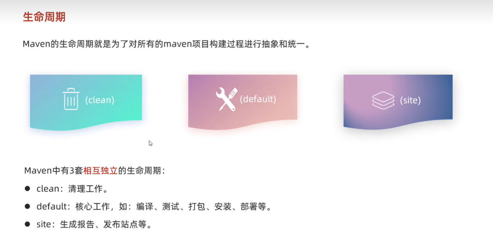
    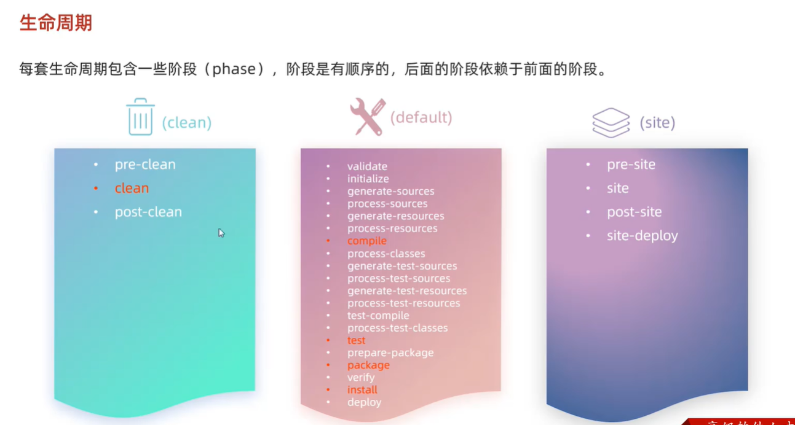
    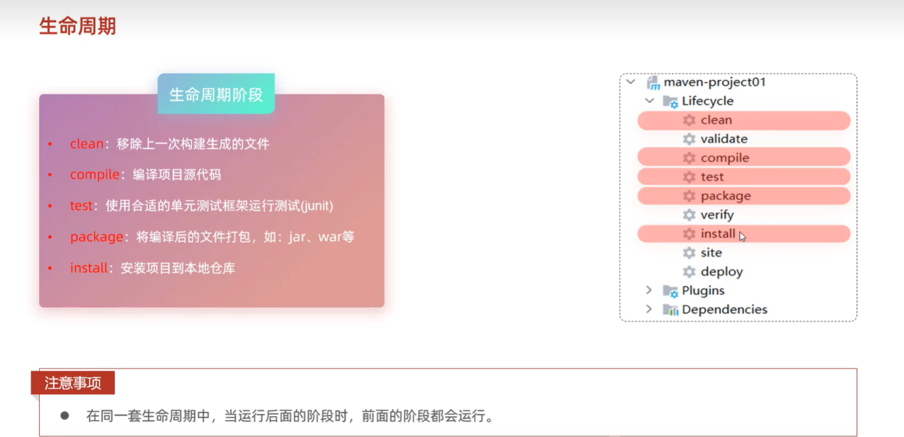
    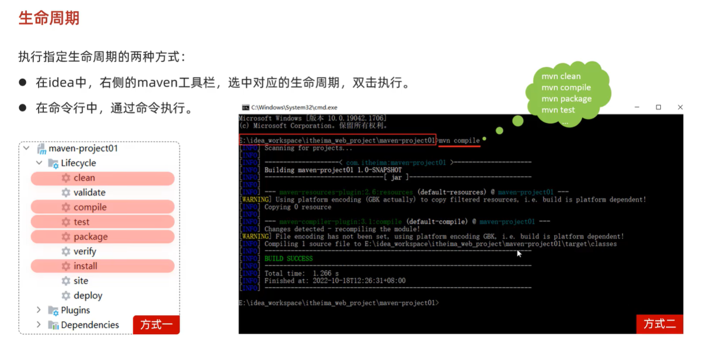

## 2025-09-03

### 黑马 JavaWeb 教程

1. 常见的状态码
   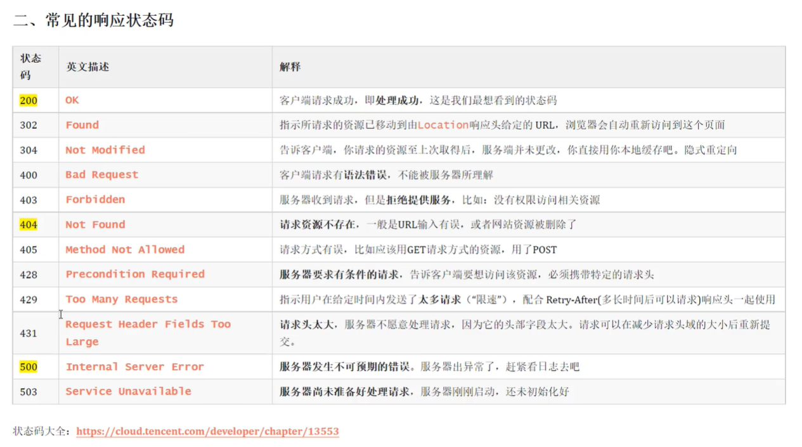
2. `DispatcherServlet` 是 SpringMVC 的核心组件，用于接收请求，并转发到相应的处理器
   - `HttpServletRequest`
   - `HttpServletResponse`
3. 请求

- `@RequestParam` 注解：用于获取请求参数，方法形参名和请求参数名一致时可以省略该注解，该注解的 required 属性表示该参数是否必须，默认为 true，如果设置为 false，则表示该参数不是必须的，可以不传，如果设置为 true，则表示该参数是必须的，必须传，否则会报错

```java
public String hello(
  @RequestParam(value = "name") String username,
  @RequestParam(value = "age", required = false, defaultValue = "18") Integer age
) {
  // TODO:
}
```

- `@DateTimeFormat` 注解：用于格式化日期时间，方法形参名和请求参数名一致时可以省略该注解，该注解的 pattern 属性表示日期时间的格式，例如：yyyy-MM-dd HH:mm:ss

```java
public String hello(
  @RequestParam(value = "name") String username,
  @RequestParam(value = "age", required = false, defaultValue = "18") Integer age,
  @DateTimeFormat(pattern = "yyyy-MM-dd HH:mm:ss") Date date
) {
  // TODO:
}
```

- `@RequestBody` 注解：用于获取请求体，方法形参名和请求参数名一致时可以省略该注解，该注解的 required 属性表示该参数是否必须，默认为 true，如果设置为 false，则表示该参数不是必须的，可以不传，如果设置为 true，则表示该参数是必须的，必须传，否则会报错

```java
@PostMapping("/hello")
public String hello(@RequestBody User user) {
  // TODO:
}
```

- `@PathVariable` 注解：用于获取路径参数，方法形参名和路径参数名一致时可以省略该注解，该注解的 value 属性表示路径参数的名称，例如：@PathVariable("id") Long id

```java
@GetMapping("/hello/{id}/{name}")
public String hello(@PathVariable Integer id @PathVariable("name") String username) {
  // TODO:
}
```

4. 响应

- @RestController = @Controller + @ResponseBody

- dom4j 解析 XML

5. 三层架构
   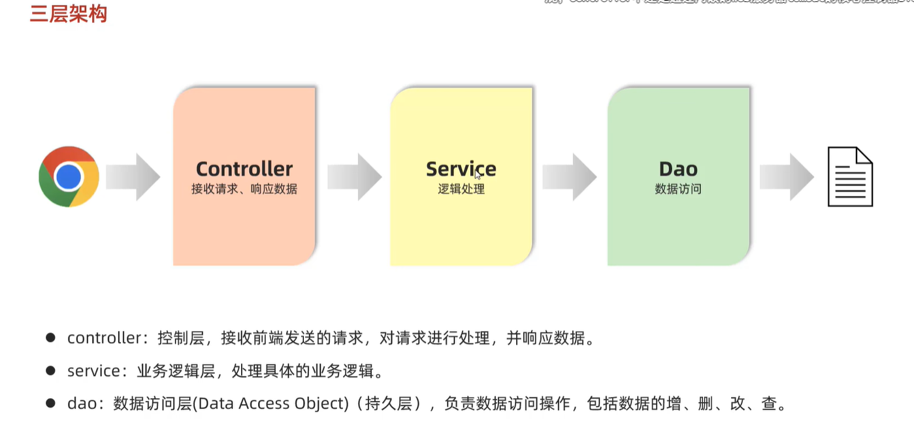
   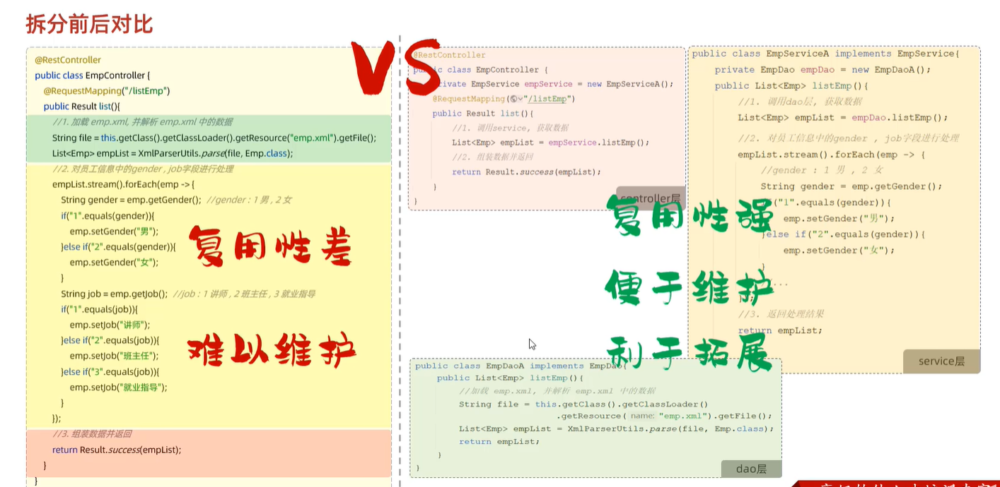

6. 控制反转 IoC Inversion of Control。对象的创建控制权由程序转移到外部容器，由容器来管理对象的生命周期，包括对象的创建、销毁、依赖注入等。

7. 依赖注入 DI Dependency Injection。对象的依赖关系由容器来管理，容器会自动将依赖的对象注入到需要的地方。

8. Bean 对象：由 Spring IOC 容器管理的对象，Spring 容器会自动创建、销毁、依赖注入等。
9. @ComponentScan 注解：用于指定 Spring 容器扫描的包路径，默认为当前类所在的包及其子包。
10. @Component 注解：用于标识一个类为 Spring 容器管理的 Bean 对象，默认值为类名的小写形式，例如：@Component("user")，则该 Bean 对象的名称为 user。
11. @Controller 注解：用于标识一个类为 Spring MVC 的控制器，该类中的方法可以处理 HTTP 请求。
12. @Service 注解：用于标识一个类为 Spring 的服务层，该类中的方法可以处理业务逻辑。
13. @Repository 注解：用于标识一个类为 Spring 的持久层，该类中的方法可以处理数据库操作。
14. @Autowired 注解：用于自动注入依赖的对象，默认为按类型注入，如果需要按名称注入，可以使用 @Qualifier 注解指定名称。
15. @SpringBootApplication 注解：用于标识一个类为 Spring Boot 的启动类，该类中的方法可以处理 HTTP 请求。
16. @Primary 注解：用于标识一个类为 Spring 的首选 Bean 对象，如果有多个相同类型的 Bean 对象，则 Spring 容器会优先选择被 @Primary 注解标识的 Bean 对象。
17. @Qualifier 注解：用于按名称注入依赖的对象，需要配合 @Autowired 注解使用。

```java
@Autowired
@Qualifier("user")
private User user;
```

18. @Resource 注解：用于按名称注入依赖的对象，需要配合 @Autowired 注解使用。

```java
@Resource(name = "user")
private User user;
```

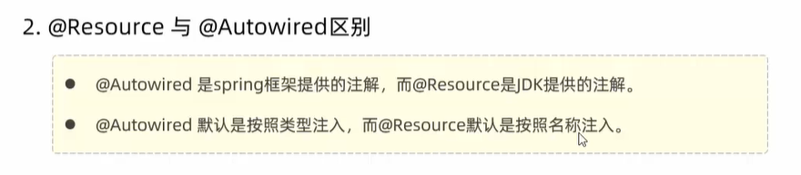

### 数据库

1. 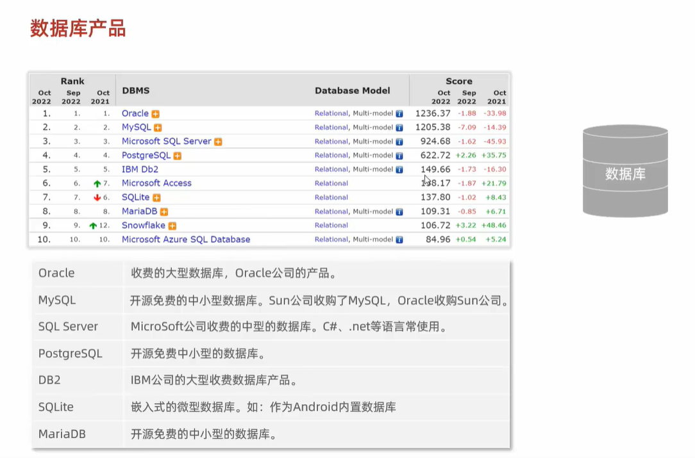
2. `mysql -h192.168.150.101 -P3306 -uroot -p123` 远程连接数据库
3. DDL（Data Definition Language）数据定义语言，用于创建、修改和删除数据库对象，例如：表、视图、索引等。

   3.1 数据库操作

- show databases; 查看所有数据库
- select database(); 查看当前数据库
- create database [if not exists] 数据库名; 创建数据库
- drop database [if exists] 数据库名; 删除数据库
- use 数据库名; 使用数据库

  3.2 表操作

- show tables; 查看当前数据库中的所有表
- desc 表名; 查看表结构
- create table 表名(
  字段 1 数据类型 [约束] [comment 注释],
  列名 2 数据类型 [约束] [comment 注释],
  ...
  ) [comment 注释]; 创建表

4. DML（Data Manipulation Language）数据操作语言，用于查询、插入、更新和删除数据，例如：SELECT、INSERT、UPDATE、DELETE 等。
5. DQL（Data Query Language）数据查询语言，用于查询数据，例如：SELECT。
6. DCL（Data Control Language）数据控制语言，用于控制用户对数据库的访问权限，例如：GRANT、REVOKE 等。

## 2025-09-04

### 黑马 JavaWeb 教程
